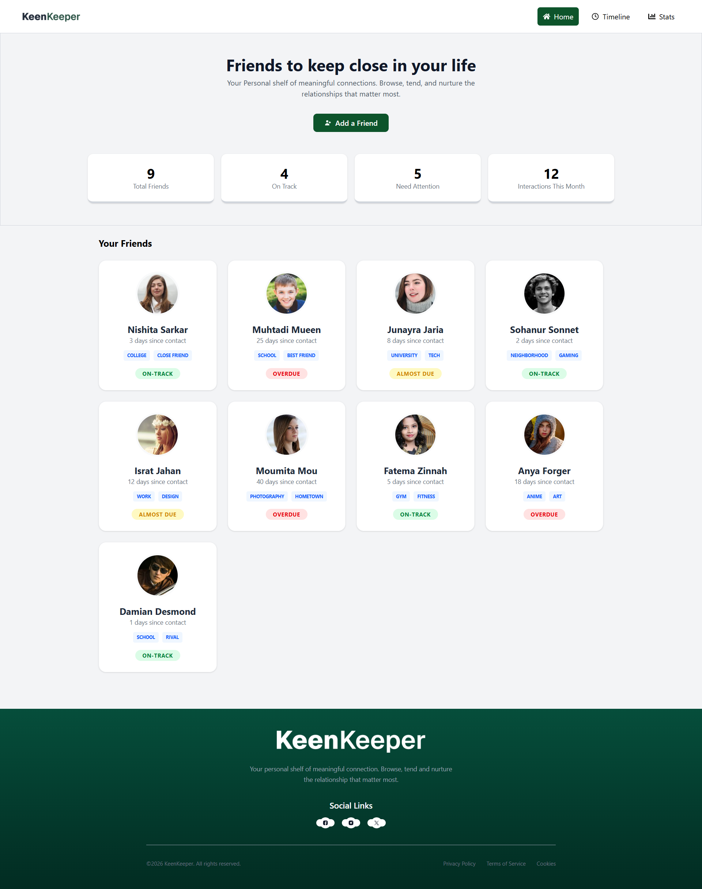
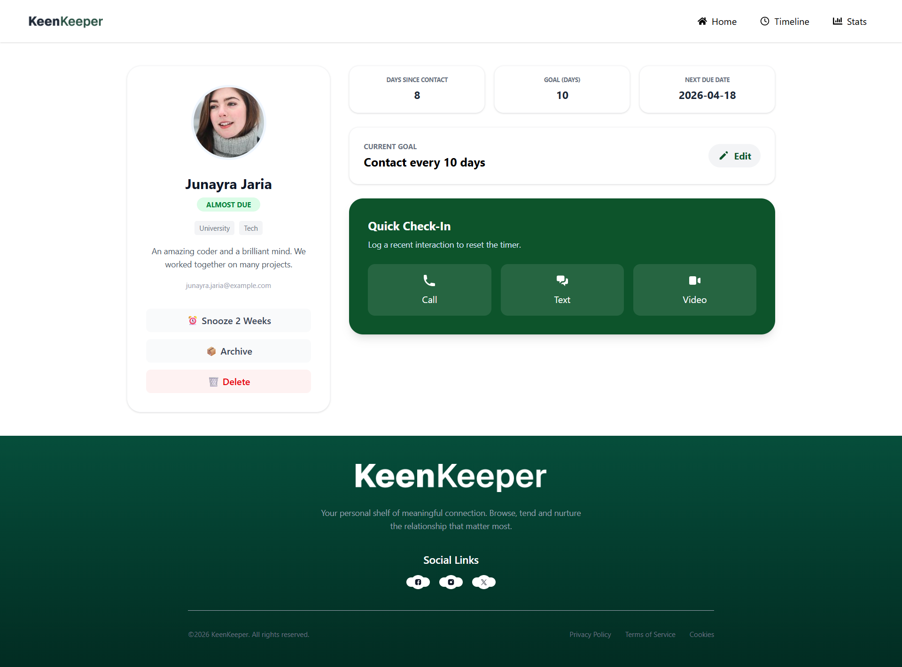
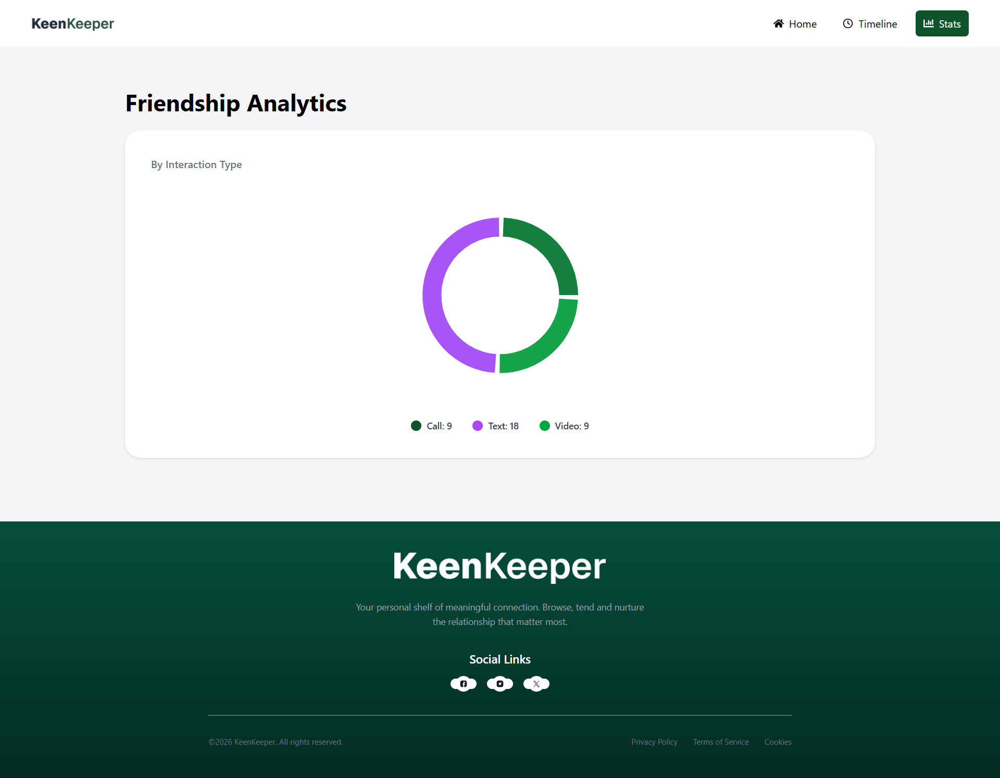
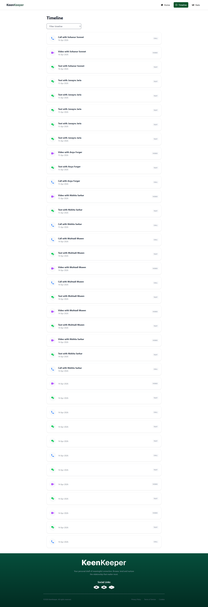

# 👥 KeenKeeper — Keep Your Friendships Alive

## 🔗 Live Site

👉 https://keen-keeperp.netlify.app

## 💻 GitHub Repository

👉 https://github.com/everluma/keen-keeper

---

## 📌 Project Description

KeenKeeper is a personal relationship management web application designed to help users maintain and nurture meaningful friendships. It allows users to track interactions, set communication goals, and visualize relationship activity through a clean and user-friendly interface.

---

## ⚙️ Technologies Used

* ⚛️ React.js
* 🔁 React Router DOM
* 🎨 Tailwind CSS
* 📊 Recharts
* 🔔 React Hot Toast
* 🌐 Netlify (Deployment)

---

## ✨ Key Features

### 👥 Friend Management

* Display all friends in a responsive card layout
* Each card shows image, name, tags, and contact status
* Click on a friend to view detailed profile

---

### 📅 Timeline Tracking

* Log interactions: Call, Text, Video
* Data stored in localStorage
* Filter timeline using dropdown (All / Call / Text / Video)

---

### 📊 Friendship Analytics

* Donut-style Pie Chart using Recharts
* Shows interaction distribution (Call/Text/Video)
* Clean UI matching Figma layout

---

### ⚡ Additional Features

* Toast notification on interaction logging
* Dynamic routing for each friend
* Custom 404 page
* Loading spinner while fetching data
* Fully responsive (mobile, tablet, desktop)

---

## 📂 Data Source

* Static JSON file (`friends.json`) from public folder
* Timeline data stored in browser localStorage

---

## 🖼️ Screenshots

### 🏠 Home Page



---

### 👤 Friend Details Page



---

### 📊 Stats Page



---

### 📜 Timeline Page



---

## 🚀 Deployment

This project is deployed on **Netlify** with proper client-side routing using a `_redirects` file to prevent reload errors.

---

## 📦 Installation (Optional)

```bash
git clone https://github.com/everluma/keen-keeper.git
cd keen-keeper
npm install
npm run dev
```

---

## 👩‍💻 Author

**Farjana Aktar Monisha**

---

## 📌 Final Notes

This project was built as part of an assignment and focuses on clean UI design, proper state management, and real-world usability.

---
